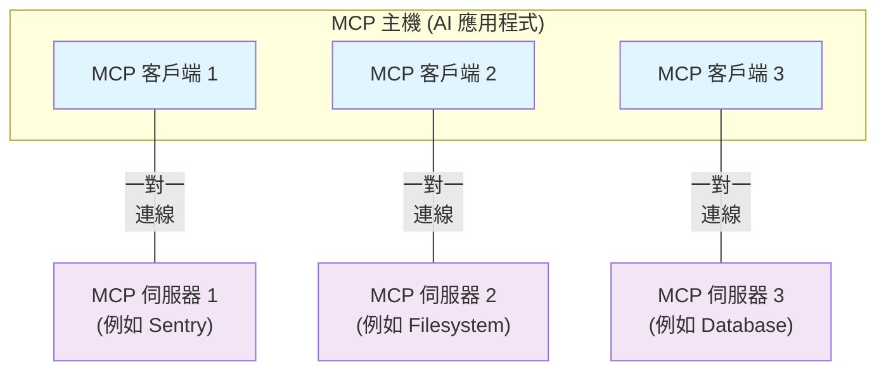

# 架構概述

這個 Model Context Protocol (MCP) 概述討論了其[範圍](#範圍)和[核心概念](#mcp-的概念)，並提供一個展示每個核心概念的[範例](#範例)。

由於 MCP SDK 抽象化了許多關注點，大多數開發者可能會發現[資料層協定](#資料層協定)章節最為有用。它討論了 MCP 伺服器如何為 AI 應用程式提供內容。

有關具體的實作細節，請參閱你的[特定語言 SDK](https://modelcontextprotocol.io/docs/sdk) 文件。

## 範圍

Model Context Protocol 包含以下專案：

* [MCP 規範](https://modelcontextprotocol.io/specification/latest)：MCP 的規範，概述了客戶端和伺服器的實作要求。
* [MCP SDK](https://modelcontextprotocol.io/docs/sdk)：實作 MCP 的不同程式語言 SDK。
* **MCP 開發工具**：開發 MCP 伺服器和客戶端的工具，包括 [MCP Inspector](https://github.com/modelcontextprotocol/inspector)
* [MCP 參考伺服器實作](https://github.com/modelcontextprotocol/servers)：MCP 伺服器的參考實作。

> **⚠️ 注意**：MCP 專注於內容交換的協定——它不規定 AI 應用程式如何使用 LLM 或管理提供的內容。

## MCP 的概念

### 參與者

MCP 遵循客戶端 - 伺服器架構，其中 MCP 主機——像 [Claude Code](https://www.anthropic.com/claude-code) 或 [Claude Desktop](https://www.claude.ai/download) 這樣的 AI 應用程式——建立與一個或多個 MCP 伺服器的連線。MCP 主機通過為每個 MCP 伺服器建立一個 MCP 客戶端來達成這一點。每個 MCP 客戶端與其對應的 MCP 伺服器維持專用的一對一連線。

MCP 架構中的關鍵參與者有：

* **MCP 主機**：協調和管理一個或多個 MCP 客戶端的 AI 應用程式
* **MCP 客戶端**：維持與 MCP 伺服器連線並從 MCP 伺服器取得內容供 MCP 主機使用的元件
* **MCP 伺服器**：向 MCP 客戶端提供內容的程式

**例如**：Visual Studio Code 充當 MCP 主機。當 Visual Studio Code 建立與 MCP 伺服器（如 [Sentry MCP server](https://docs.sentry.io/product/sentry-mcp/)）的連線時，Visual Studio Code 執行階段會實例化一個 MCP 客戶端物件來維持與 Sentry MCP 伺服器的連線。
當 Visual Studio Code 隨後連線到另一個 MCP 伺服器（如 [本地檔案系統伺服器](https://github.com/modelcontextprotocol/servers/tree/main/src/filesystem)）時，Visual Studio Code 執行階段會實例化額外的 MCP 客戶端物件來維持這個連線，因此維持 MCP 客戶端與 MCP 伺服器的一對一關係。



請注意，**MCP 伺服器**指的是提供內容資料的程式，無論它在哪裡執行。MCP 伺服器可以在本地或遠端執行。例如，當 Claude Desktop 啟動 [檔案系統伺服器](https://github.com/modelcontextprotocol/servers/tree/main/src/filesystem) 時，伺服器在同一台機器上本地執行，因為它使用 STDIO 傳輸。這通常被稱為「本地」MCP 伺服器。官方的 [Sentry MCP server](https://docs.sentry.io/product/sentry-mcp/) 在 Sentry 平台上執行，並使用 Streamable HTTP 傳輸。這通常被稱為「遠端」MCP 伺服器。

### 層級

MCP 由兩個層級組成：

* **資料層**：定義基於 JSON-RPC 的客戶端 - 伺服器通訊協定，包括生命週期管理、核心原語，如工具、資源、提示和通知。
* **傳輸層**：定義通訊機制和通道，實現客戶端和伺服器之間的資料交換，包括特定傳輸的連線建立、訊息框架和授權。

概念上，資料層是內層，而傳輸層是外層。

#### 資料層

資料層實作基於 [JSON-RPC 2.0](https://www.jsonrpc.org/) 的交換協定，定義訊息結構和語義。
這個層級包括：

* **生命週期管理**：處理客戶端和伺服器之間的連線初始化、能力協商和連線終止
* **伺服器特性**：使伺服器能夠提供核心功能，包括 AI 動作的工具、內容資料的資源，以及從客戶端互動範本的提示
* **客戶端特性**：使伺服器能夠要求客戶端從主機 LLM 採樣、從使用者那裡取得輸入，以及將訊息記錄到客戶端
* **實用特性**：支援額外能力，如即時更新通知和長時間執行操作的進度追蹤

#### 傳輸層

傳輸層管理客戶端和伺服器之間的通訊通道和身份驗證。它處理連線建立、訊息框架和 MCP 參與者之間的安全通訊。

MCP 支援兩種傳輸機制：

* **Stdio 傳輸**：使用標準輸入/輸出串流進行同一台機器上本地程序之間的直接程序通訊，提供最佳效能且無網路開銷。
* **Streamable HTTP 傳輸**：使用 HTTP POST 進行客戶端到伺服器的訊息，可選的 Server-Sent Events 用於串流功能。此傳輸啟用遠端伺服器通訊，並支援標準 HTTP 身份驗證方法，包括 bearer token、API 金鑰和自訂標頭。MCP 建議使用 OAuth 來取得身份驗證 token。

傳輸層從協定層抽象化通訊細節，使相同的 JSON-RPC 2.0 訊息格式能夠跨所有傳輸機制使用。

### 資料層協定

MCP 的核心部分是定義 MCP 客戶端和 MCP 伺服器之間的模式和語義。開發者可能會發現資料層——特別是[原語](#原語)集合——是 MCP 最有趣的部分。它是 MCP 中定義開發者可以從 MCP 伺服器向 MCP 客戶端共享內容方式的部分。

MCP 使用 [JSON-RPC 2.0](https://www.jsonrpc.org/) 作為其底層 RPC 協定。客戶端和伺服器相互發送請求並相應回應。當不需要回應時可以使用通知。

#### 生命週期管理

MCP 是一個需要生命週期管理的有狀態協定。生命週期管理的目的是協商客戶端和伺服器都支援的能力。詳細資訊可以在[規範](https://modelcontextprotocol.io/specification/2025-06-18/basic/lifecycle)中找到，[範例](#範例)展示了初始化序列。

#### 原語

MCP 原語是 MCP 中最重要的概念。它們定義了客戶端和伺服器可以相互提供什麼。這些原語指定了可以與 AI 應用程式共享的內容資訊類型和可以執行的動作範圍。

MCP 定義了*伺服器*可以暴露的三個核心原語：

* **工具**：AI 應用程式可以呼叫以執行動作的可執行函式（例如，檔案操作、API 呼叫、資料庫查詢）
* **資源**：為 AI 應用程式提供內容資訊的資料來源（例如，檔案內容、資料庫記錄、API 回應）
* **提示**：幫助構建與語言模型互動的可重複使用範本（例如，系統提示、少量樣本範例）

每種原語類型都有相關的探索（`*/list`）、檢索（`*/get`）方法，在某些情況下還有執行（`tools/call`）方法。
MCP 客戶端將使用 `*/list` 方法來探索可用的原語。例如，客戶端可以首先列出所有可用工具（`tools/list`），然後執行它們。此設計允許列表是動態的。

作為一個具體範例，考慮一個提供資料庫內容的 MCP 伺服器。它可以暴露用於查詢資料庫的工具、包含資料庫模式的資源，以及包含與工具互動的少量樣本範例的提示。

有關伺服器原語的更多詳情，請參閱[伺服器概念](./server-concepts)。

MCP 也定義了*客戶端*可以暴露的原語。這些原語允許 MCP 伺服器作者建立更豐富的互動。

* **採樣**：允許伺服器從客戶端的 AI 應用程式請求語言模型完成。這在伺服器作者想要存取語言模型，但想要保持模型獨立且不在其 MCP 伺服器中包含語言模型 SDK 時很有用。他們可以使用 `sampling/complete` 方法從客戶端的 AI 應用程式請求語言模型完成。
* **請求**：允許伺服器從使用者請求額外資訊。這在伺服器作者想要從使用者那裡獲取更多資訊或要求確認動作時很有用。他們可以使用 `elicitation/request` 方法從使用者請求額外資訊。
* **記錄**：使伺服器能夠向客戶端發送記錄訊息以進行除錯和監控。

有關客戶端原語的更多詳情，請參閱[客戶端概念](./client-concepts)。

#### 通知

協定支援即時通知以啟用伺服器和客戶端之間的動態更新。例如，當伺服器的可用工具發生變化時——如新功能變得可用或現有工具被修改——伺服器可以發送工具更新通知來通知連線的客戶端這些變化。通知作為 JSON-RPC 2.0 通知訊息發送（不期望回應），並使 MCP 伺服器能夠向連線的客戶端提供即時更新。

## 範例

### 資料層

本節提供 MCP 客戶端 - 伺服器互動的逐步演練，專注於資料層協定。我們將使用 JSON-RPC 2.0 訊息演示生命週期序列、工具操作和通知。

### 步驟 1：初始化（生命週期管理）

MCP 通過能力協商握手開始生命週期管理。如[生命週期管理](#生命週期管理)章節所述，客戶端發送 `initialize` 請求以建立連線並協商支援的特性。

**請求**
```json
{
  "jsonrpc": "2.0",
  "id": 1,
  "method": "initialize",
  "params": {
    "protocolVersion": "2025-06-18",
    "capabilities": {
      "tools": {}
    },
    "clientInfo": {
      "name": "example-client",
      "version": "1.0.0"
    }
  }
}
```

**回應**
```json
{
  "jsonrpc": "2.0",
  "id": 1,
  "result": {
    "protocolVersion": "2025-06-18",
    "capabilities": {
      "tools": {
        "listChanged": true
      },
      "resources": {}
    },
    "serverInfo": {
      "name": "example-server",
      "version": "1.0.0"
    }
  }
}
```

#### 理解初始化交換

初始化程序是 MCP 生命週期管理的關鍵部分，並有幾個重要目的：

1. **協定版本協商**：`protocolVersion` 欄位（例如 "2025-06-18"）確保客戶端和伺服器都使用相容的協定版本。這防止不同版本嘗試互動時可能發生的通訊錯誤。如果無法協商到相互相容的版本，應該終止連線。

2. **能力探索**：`capabilities` 物件允許各方宣告他們支援的特性，包括他們可以處理的[原語](#原語)（工具、資源、提示）以及他們是否支援如[通知](#通知)等特性。這通過避免不支援的操作來實現高效通訊。

3. **身份交換**：`clientInfo` 和 `serverInfo` 物件提供識別和版本資訊以進行除錯和相容性目的。

在此範例中，能力協商演示了如何宣告 MCP 原語：

**客戶端能力**：

* `"tools": {}` - 客戶端宣告它可以使用工具原語（可以呼叫 `tools/list` 和 `tools/call` 方法）

**伺服器能力**：

* `"tools": {"listChanged": true}` - 伺服器支援工具原語並且可以在其工具清單變化時發送 `tools/list_changed` 通知
* `"resources": {}` - 伺服器還支援資源原語（可以處理 `resources/list` 和 `resources/read` 方法）

成功初始化後，客戶端發送通知以表示已準備好：

**通知**
```json
{
  "jsonrpc": "2.0",
  "method": "notifications/initialized"
}
```

#### 這在 AI 應用程式中如何運作

在初始化期間，AI 應用程式的 MCP 客戶端管理器建立與配置伺服器的連線並儲存其能力供稍後使用。應用程式使用此資訊來確定哪些伺服器可以提供特定類型的功能（工具、資源、提示）以及它們是否支援即時更新。

```python
# 偽程式碼
async with stdio_client(server_config) as (read, write):
    async with ClientSession(read, write) as session:
        init_response = await session.initialize()
        if init_response.capabilities.tools:
            app.register_mcp_server(session, supports_tools=True)
        app.set_server_ready(session)
```

### 步驟 2：工具探索（原語）

現在連線已建立，客戶端可以通過發送 `tools/list` 請求來探索可用工具。此請求是 MCP 工具探索機制的基礎——它允許客戶端在嘗試使用工具之前了解伺服器上有哪些工具可用。

**請求**
```json
{
  "jsonrpc": "2.0",
  "id": 2,
  "method": "tools/list"
}
```

**回應**
```json
{
  "jsonrpc": "2.0",
  "id": 2,
  "result": {
    "tools": [
      {
        "name": "com.example.calculator/arithmetic",
        "title": "Calculator",
        "description": "執行數學計算，包括基本算術、三角函式和代數運算",
        "inputSchema": {
          "type": "object",
          "properties": {
            "expression": {
              "type": "string",
              "description": "要計算的數學表達式（例如 '2 + 3 * 4', 'sin(30)', 'sqrt(16)'）"
            }
          },
          "required": ["expression"]
        }
      },
      {
        "name": "com.example.weather/current",
        "title": "Weather Information",
        "description": "取得全球任何地點的目前天氣資訊",
        "inputSchema": {
          "type": "object",
          "properties": {
            "location": {
              "type": "string",
              "description": "城市名稱、地址或座標（緯度，經度）"
            },
            "units": {
              "type": "string",
              "enum": ["metric", "imperial", "kelvin"],
              "description": "回應中使用的溫度單位",
              "default": "metric"
            }
          },
          "required": ["location"]
        }
      }
    ]
  }
}
```

#### 理解工具探索請求

`tools/list` 請求很簡單，不包含參數。

#### 理解工具探索回應

回應包含一個 `tools` 陣列，提供每個可用工具的綜合中繼資料。這種基於陣列的結構允許伺服器同時暴露多個工具，同時在不同功能之間保持清晰的界限。

回應中的每個工具物件包含幾個關鍵欄位：

* **`name`**：伺服器命名空間內工具的唯一識別碼。這作為工具執行的主鍵，應該是類似 URI 的格式以獲得更好的命名空間（例如 `com.example.calculator/arithmetic` 而不只是 `calculate`）
* **`title`**：工具的可讀顯示名稱，客戶端可以向使用者顯示
* **`description`**：工具功能和使用時機的詳細說明
* **`inputSchema`**：定義預期輸入參數的 JSON Schema，啟用類型驗證並提供關於必需和可選參數的清晰文件

#### 這在 AI 應用程式中如何運作

AI 應用程式從所有連線的 MCP 伺服器獲取可用工具，並將它們組合成語言模型可以存取的統一工具註冊表。這允許 LLM 了解它可以執行哪些動作，並在對話期間自動產生適當的工具呼叫。

```python
# 使用 MCP Python SDK 模式的偽程式碼
available_tools = []
for session in app.mcp_server_sessions():
    tools_response = await session.list_tools()
    available_tools.extend(tools_response.tools)
conversation.register_available_tools(available_tools)
```

### 步驟 3：工具執行（原語）

客戶端現在可以使用 `tools/call` 方法執行工具。這演示了 MCP 原語在實際中如何使用：在探索可用工具後，客戶端可以使用適當的參數呼叫它們。

#### 理解工具執行請求

`tools/call` 請求遵循結構化格式，確保客戶端和伺服器之間的類型安全和清晰通訊。請注意，我們使用來自探索回應的正確工具名稱（`com.example.weather/current`）而不是簡化名稱：

**請求**
```json
{
  "jsonrpc": "2.0",
  "id": 3,
  "method": "tools/call",
  "params": {
    "name": "com.example.weather/current",
    "arguments": {
      "location": "San Francisco",
      "units": "imperial"
    }
  }
}
```

**回應**
```json
{
  "jsonrpc": "2.0",
  "id": 3,
  "result": {
    "content": [
      {
        "type": "text",
        "text": "舊金山目前天氣：68°F，部分多雲，西風 8 mph。濕度：65%"
      }
    ]
  }
}
```

#### 工具執行的關鍵要素

請求結構包含幾個重要元件：

1. **`name`**：必須完全符合探索回應中的工具名稱（`com.example.weather/current`）。這確保伺服器可以正確識別要執行的工具。

2. **`arguments`**：包含工具 `inputSchema` 定義的輸入參數。在此範例中：

   * `location`："San Francisco"（必需參數）
   * `units`："imperial"（可選參數，如未指定則預設為 "metric"）

3. **JSON-RPC 結構**：使用標準 JSON-RPC 2.0 格式，具有唯一 `id` 用於請求 - 回應關聯。

#### 理解工具執行回應

回應演示了 MCP 的靈活內容系統：

1. **`content` 陣列**：工具回應回傳內容物件陣列，允許豐富的多格式回應（文字、圖片、資源等）

2. **內容類型**：每個內容物件都有 `type` 欄位。在此範例中，`"type": "text"` 表示純文字內容，但 MCP 支援各種內容類型以適應不同使用情況。

3. **結構化輸出**：回應提供 AI 應用程式可以用作語言模型互動內容的可行資訊。

此執行模式允許 AI 應用程式動態呼叫伺服器功能並接收可以整合到與語言模型對話中的結構化回應。

#### 這在 AI 應用程式中如何運作

當語言模型決定在對話期間使用工具時，AI 應用程式攔截工具呼叫，將其路由到適當的 MCP 伺服器，執行它，並將結果作為對話流程的一部分回傳給 LLM。這使 LLM 能夠存取即時資料並在外部世界中執行動作。

```python
# AI 應用程式工具執行的偽程式碼
async def handle_tool_call(conversation, tool_name, arguments):
    session = app.find_mcp_session_for_tool(tool_name)
    result = await session.call_tool(tool_name, arguments)
    conversation.add_tool_result(result.content)
```

### 步驟 4：即時更新（通知）

MCP 支援即時通知，使伺服器能夠在不被明確請求的情況下通知客戶端變化。這演示了通知系統，這是保持 MCP 連線同步和響應的關鍵特性。

#### 理解工具清單變更通知

當伺服器的可用工具發生變化時——如新功能變得可用、現有工具被修改或工具暫時不可用——伺服器可以主動通知連線的客戶端：

```json
{
  "jsonrpc": "2.0",
  "method": "notifications/tools/list_changed"
}
```

#### MCP 通知的關鍵特性

1. **不需要回應**：注意通知中沒有 `id` 欄位。這遵循 JSON-RPC 2.0 通知語義，其中不期望或發送回應。

2. **基於能力**：此通知僅由在初始化期間在其工具能力中宣告 `"listChanged": true` 的伺服器發送（如步驟 1 所示）。

3. **事件驅動**：伺服器根據內部狀態變化決定何時發送通知，使 MCP 連線動態且響應。

#### 客戶端對通知的回應

收到此通知後，客戶端通常通過請求更新的工具清單來回應。這建立了刷新循環，保持客戶端對可用工具的理解是最新的：

```json
{
  "jsonrpc": "2.0",
  "id": 4,
  "method": "tools/list"
}
```

#### 為什麼通知很重要

此通知系統對於以下幾個原因至關重要：

1. **動態環境**：工具可能會根據伺服器狀態、外部依賴或使用者權限來來去去
2. **效率**：客戶端不需要輪詢變化；當更新發生時會被通知
3. **一致性**：確保客戶端始終擁有關於可用伺服器能力的準確資訊
4. **即時協作**：啟用可以適應變化內容的響應式 AI 應用程式

此通知模式擴展到除工具之外的其他 MCP 原語，實現客戶端和伺服器之間的全面即時同步。

#### 這在 AI 應用程式中如何運作

當 AI 應用程式收到關於工具變更的通知時，它立即刷新其工具註冊表並更新 LLM 的可用能力。這確保進行中的對話始終能夠存取最新的工具集，並且 LLM 可以動態適應新功能的可用性。

```python
# AI 應用程式通知處理的偽程式碼
async def handle_tools_changed_notification(session):
    tools_response = await session.list_tools()
    app.update_available_tools(session, tools_response.tools)
    if app.conversation.is_active():
        app.conversation.notify_llm_of_new_capabilities()
```