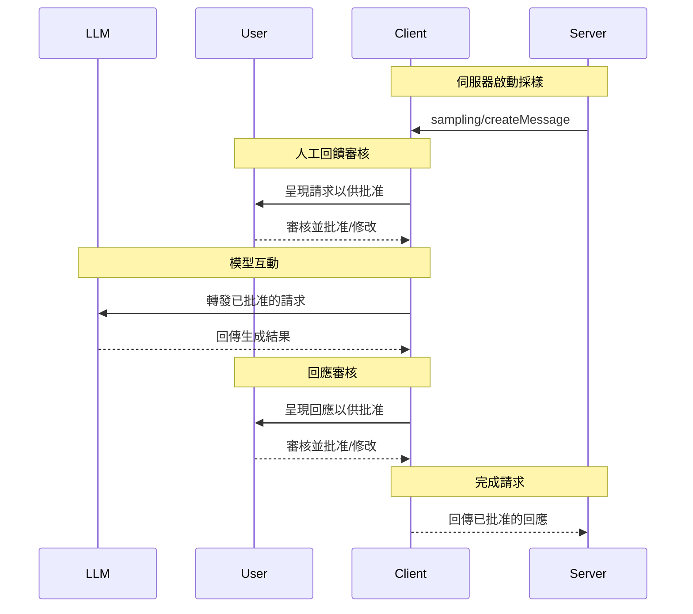
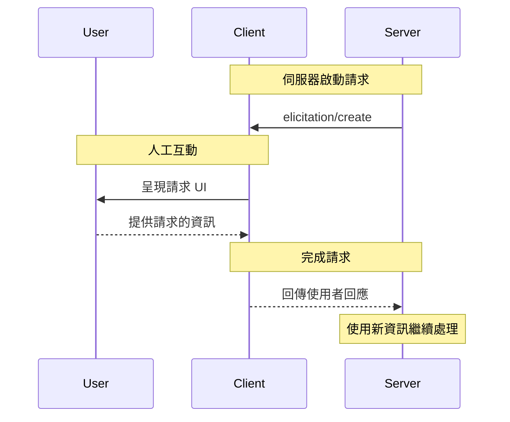

# 客戶端概念

> 理解 MCP 客戶端概念

MCP 客戶端由主機應用程式實例化，用於與特定的 MCP 伺服器通訊。主機應用程式（如 Claude.ai 或 IDE）管理整體使用者體驗並協調多個客戶端。每個客戶端處理與一個伺服器的直接通訊。

理解這個區別很重要：*主機*是使用者互動的應用程式，而*客戶端*是啟用伺服器連線的協定層級元件。

## 核心客戶端特性

除了使用伺服器提供的內容外，客戶端還可以向伺服器提供多種特性。這些客戶端特性允許伺服器作者建立更豐富的互動。例如，客戶端可以允許 MCP 伺服器透過請求向使用者請求額外資訊。客戶端可以提供以下能力：

### 採樣

採樣允許伺服器透過客戶端請求語言模型完成，在維持安全性和使用者控制的同時啟用代理行為。

#### 概述

採樣使伺服器能夠執行依賴 AI 的任務，而無需直接整合或支付 AI 模型費用。相反，伺服器可以請求已經具有 AI 模型存取權限的客戶端代表它們處理這些任務。這種方法讓客戶端完全控制使用者權限和安全措施。由於採樣請求發生在其他操作的內容中——如工具分析資料——並作為單獨的模型呼叫處理，它們在不同內容之間保持清晰的界限，允許更有效地使用內容視窗。

**採樣流程：**



此流程通過多個人工回饋檢查點確保安全性。使用者審核並可以修改初始請求和生成的回應，然後再回傳給伺服器。

**請求參數範例：**

```typescript
{
  messages: [
    {
      role: "user",
      content: "分析這些航班選項並推薦最佳選擇：\n" +
               "[47 個航班，包含價格、時間、航空公司和轉機]\n" +
               "使用者偏好：早晨出發，最多 1 次轉機"
    }
  ],
  modelPreferences: {
    hints: [{
      name: "claude-3-5-sonnet"  // 建議的模型
    }],
    costPriority: 0.3,      // 較不關心 API 成本
    speedPriority: 0.2,     // 可以等待徹底分析
    intelligencePriority: 0.9  // 需要複雜的權衡評估
  },
  systemPrompt: "你是一位旅遊專家，幫助使用者根據他們的偏好找到最佳航班",
  maxTokens: 1500
}
```

#### 範例：航班分析工具

考慮一個旅遊預訂伺服器，它有一個名為 `findBestFlight` 的工具，使用採樣來分析可用航班並推薦最佳選擇。當使用者問「為我預訂下個月到巴塞隆納的最佳航班」時，該工具需要 AI 協助來評估複雜的權衡。

該工具查詢航空公司 API 並收集 47 個航班選項。然後它請求 AI 協助分析這些選項：「分析這些航班選項並推薦最佳選擇：[47 個航班，包含價格、時間、航空公司和轉機] 使用者偏好：早晨出發，最多 1 次轉機。」

客戶端問使用者：「允許採樣請求？」批准後，AI 評估權衡——如較便宜的紅眼航班與方便的早晨出發。該工具使用此分析來呈現前三個推薦。

#### 使用者互動模型

採樣以人工回饋控制作為基本原則而設計。使用者通過幾種機制保持監督：

**批准控制**：每個採樣請求都需要明確的使用者同意。客戶端顯示伺服器想要分析什麼以及為什麼。使用者可以批准、拒絕或修改請求。

**透明度特性**：客戶端顯示確切的提示、模型選擇和 token 限制。使用者在 AI 回應回傳給伺服器之前審核它們。

**配置選項**：使用者可以設定模型偏好，為可信操作配置自動批准，或要求對所有內容進行批准。客戶端可能提供選項來編輯敏感資訊。使用者通過 `includeContext` 參數決定多少對話內容可以包含在採樣請求中。

**隔離**：採樣請求預設與主要對話內容隔離。伺服器無法存取使用者對話。

**安全考量**：客戶端和伺服器在採樣期間都必須適當處理敏感資料。客戶端應該實作速率限制並驗證所有訊息內容。人工回饋設計確保伺服器啟動的 AI 互動無法在沒有明確使用者同意的情況下危害安全或存取敏感資料。

### 根目錄

根目錄為伺服器操作定義檔案系統界限，允許客戶端指定伺服器應該專注於哪些目錄。

#### 概述

根目錄是客戶端向伺服器傳達檔案系統存取界限的機制。它們由指示伺服器可以操作的目錄的檔案 URI 組成，幫助伺服器了解可用檔案和資料夾的範圍。根目錄不是給伺服器無限制的檔案系統存取權，而是在維持安全界限的同時引導它們到相關的工作目錄。

**根目錄結構：**

```json
{
  "uri": "file:///Users/agent/travel-planning",
  "name": "Travel Planning Workspace"
}
```

根目錄專門是檔案系統路徑，始終使用 `file://` URI 方案。它們幫助伺服器了解專案界限、工作區組織和可存取的目錄。根目錄清單可以在使用者處理不同專案或資料夾時動態更新，當界限變化時，伺服器通過 `roots/list_changed` 接收通知。

重要的是要注意，雖然根目錄為伺服器提供操作位置的指導，但客戶端始終完全控制檔案存取。根目錄只是傳達預期界限——實際的檔案存取始終由客戶端的安全策略調解。

#### 範例：旅遊規劃工作區

處理多個客戶行程的旅遊代理從根目錄中受益，以組織檔案系統存取。考慮一個具有旅遊規劃各個方面不同目錄的工作區。

客戶端向旅遊規劃伺服器提供檔案系統根目錄：

* `file:///Users/agent/travel-planning` - 包含所有旅遊檔案的主要工作區
* `file:///Users/agent/travel-templates` - 可重複使用的行程範本和資源
* `file:///Users/agent/client-documents` - 客戶護照和旅遊文件

當代理建立巴塞隆納行程時，伺服器在這些界限內工作——存取範本、儲存新行程和參考客戶文件。它無法存取這些根目錄之外的檔案。伺服器通常通過使用來自根目錄的相對路徑或利用尊重根目錄界限的檔案搜尋工具來存取根目錄內的檔案。

如果代理開啟像 `file:///Users/agent/archive/2023-trips` 這樣的存檔資料夾，客戶端通過 `roots/list_changed` 更新根目錄清單。

#### 使用者互動模型

根目錄通常由主機應用程式根據使用者動作自動管理，儘管某些應用程式可能暴露手動根目錄管理：

**自動根目錄檢測**：當使用者開啟資料夾時，客戶端自動將它們暴露為根目錄。開啟旅遊工作區為伺服器提供對該目錄內行程和文件的存取。

**手動根目錄配置**：進階使用者可以通過配置指定根目錄。例如，為可重複使用的資源新增 `/travel-templates`，同時排除包含財務記錄的目錄。

### 請求

請求使伺服器能夠在互動期間從使用者請求特定資訊，建立更動態和響應的工作流程。

#### 概述

請求為伺服器提供了一種結構化的方式來按需收集必要資訊。伺服器不是要求提前提供所有資訊或在資料缺失時失敗，而是可以暫停其操作以從使用者請求特定輸入。這建立了更靈活的互動，其中伺服器適應使用者需求而不是遵循僵化的模式。

**請求流程：**



此流程啟用動態資訊收集。伺服器可以在需要時請求特定資料，使用者通過適當的 UI 提供資訊，伺服器使用新獲得的內容繼續處理。

**請求元件範例：**

```typescript
{
  method: "elicitation/requestInput",
  params: {
    message: "請確認您的巴塞隆納假期預訂詳情：",
    schema: {
      type: "object",
      properties: {
        confirmBooking: {
          type: "boolean",
          description: "確認預訂（航班 + 酒店 = $3,000）"
        },
        seatPreference: {
          type: "string",
          enum: ["window", "aisle", "no preference"],
          description: "航班偏好座位類型"
        },
        roomType: {
          type: "string",
          enum: ["sea view", "city view", "garden view"],
          description: "酒店偏好房間類型"
        },
        travelInsurance: {
          type: "boolean",
          default: false,
          description: "新增旅遊保險（$150）"
        }
      },
      required: ["confirmBooking"]
    }
  }
}
```

#### 範例：假期預訂批准

旅遊預訂伺服器通過最終預訂確認過程展示了請求的威力。當使用者選擇了他們理想的巴塞隆納假期套餐時，伺服器需要在繼續之前收集最終批准和任何缺失的詳情。

伺服器以結構化請求請求預訂確認，包括行程摘要（巴塞隆納航班 6 月 15-22 日，海濱酒店，總計 $3,000）和任何額外偏好的欄位——如座位選擇、房間類型或旅遊保險選項。

隨著預訂的進行，伺服器請求完成預訂所需的聯絡資訊。它可能要求航班預訂的旅客詳情、酒店的特殊要求或緊急聯絡資訊。

#### 使用者互動模型

請求互動設計為清晰、有內容相關性且尊重使用者自主權：

**請求呈現**：客戶端顯示請求請求，並清楚說明哪個伺服器在詢問、為什麼需要資訊以及如何使用。請求訊息解釋目的，而模式提供結構和驗證。

**回應選項**：使用者可以通過適當的 UI 控制項（文字欄位、下拉選單、核取方塊）提供請求的資訊、拒絕提供資訊並可選擇說明，或取消整個操作。客戶端在將回應回傳給伺服器之前根據提供的模式驗證回應。

**隱私考量**：請求從不請求密碼或 API 金鑰。客戶端警告可疑請求並讓使用者在發送之前審核資料。