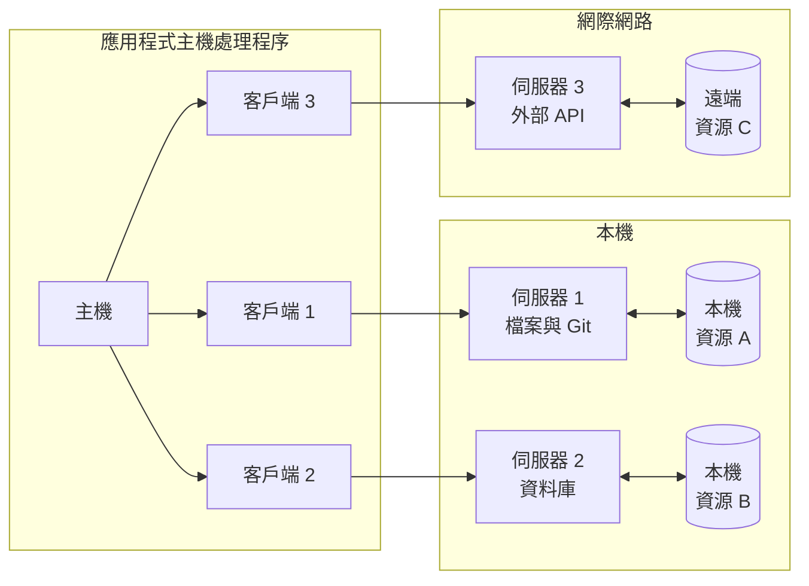
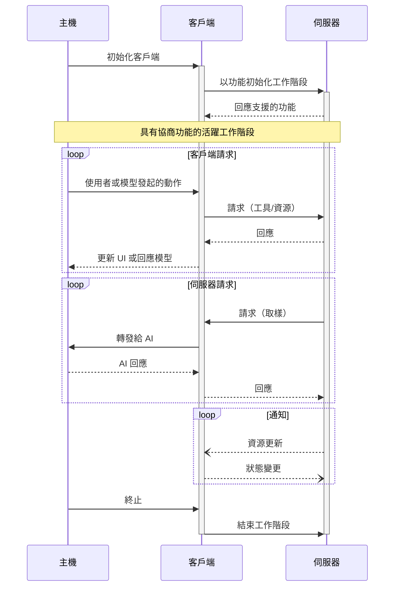

# 架構

Model Context Protocol (MCP) 採用客戶端 - 主機 - 伺服器架構，其中每個主機可以執行多個客戶端實例。這種架構讓使用者能夠在應用程式間整合 AI 功能，同時維持清楚的安全邊界並分離關注點。MCP 建構在 JSON-RPC 之上，提供一個有狀態的工作階段協定，專注於客戶端與伺服器之間的情境脈絡交換和取樣協調。

## 核心元件

### 主機

主機處理程序作為容器和協調者：

* 建立和管理多個客戶端實例
* 控制客戶端連線權限和生命週期
* 執行安全政策和同意要求
* 處理使用者授權決策
* 協調 AI/LLM 整合和取樣
* 管理跨客戶端的情境脈絡聚合

### 客戶端

每個客戶端由主機建立，並維持與伺服器的隔離連線：

* 為每個伺服器建立一個有狀態的工作階段
* 處理協定協商和功能交換
* 雙向路由協定訊息
* 管理訂閱和通知
* 維持伺服器間的安全邊界

主機應用程式建立並管理多個客戶端，每個客戶端與特定伺服器具有一對一的關係。

### 伺服器

伺服器提供專門的情境脈絡和功能：

* 透過 MCP 原語公開資源、工具和提示
* 以專注的職責獨立運作
* 透過客戶端介面請求取樣
* 必須遵守安全約束
* 可以是本機處理程序或遠端服務

## 設計原則

MCP 建構在幾個關鍵設計原則之上，這些原則指導其架構和實作：

1. **伺服器應該極易建置**

   * 主機應用程式處理複雜的協調職責
   * 伺服器專注於特定且定義明確的功能
   * 簡單的介面最小化實作開銷
   * 清楚的分離讓程式碼更易維護

2. **伺服器應該高度可組合**

   * 每個伺服器在隔離環境中提供專注的功能
   * 多個伺服器可以無縫結合
   * 共享協定支援互通性
   * 模組化設計支援擴充性

3. **伺服器不應該能夠讀取整個對話，也不能「窺視」其他伺服器**

   * 伺服器只接收必要的情境脈絡資訊
   * 完整的對話歷史記錄保留在主機端
   * 每個伺服器連線維持隔離
   * 跨伺服器互動由主機控制
   * 主機處理程序執行安全邊界

4. **功能可以逐步添加到伺服器和客戶端中**
   * 核心協定提供最小必需功能
   * 可根據需要協商額外功能
   * 伺服器和客戶端獨立演進
   * 協定為未來擴充性而設計
   * 維持向後相容性

## 功能協商

Model Context Protocol 使用基於功能的協商系統，客戶端和伺服器在初始化期間明確宣告其支援的功能。功能決定了工作階段期間可用的協定功能和原語。

* 伺服器宣告如資源訂閱、工具支援和提示樣板等功能
* 客戶端宣告如取樣支援和通知處理等功能
* 雙方必須在整個工作階段中尊重已宣告的功能
* 可以透過協定擴充來協商額外功能

每個功能都會解鎖特定的協定功能供工作階段使用。例如：

* 已實作的[伺服器功能](https://modelcontextprotocol.io/specification/2025-06-18/server)必須在伺服器的功能中宣告
* 發出資源訂閱通知需要伺服器宣告訂閱支援
* 工具呼叫需要伺服器宣告工具功能
* [取樣](https://modelcontextprotocol.io/specification/2025-06-18/client)需要客戶端在其功能中宣告支援

這種功能協商確保客戶端和伺服器對支援的功能有清楚的了解，同時維持協定的擴充性。
